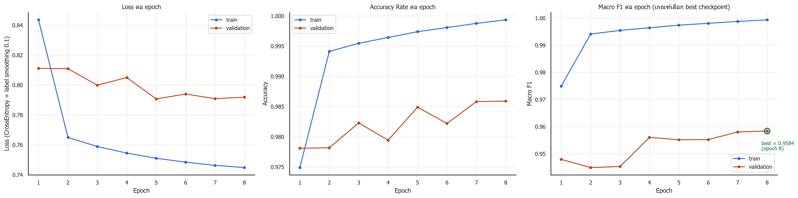
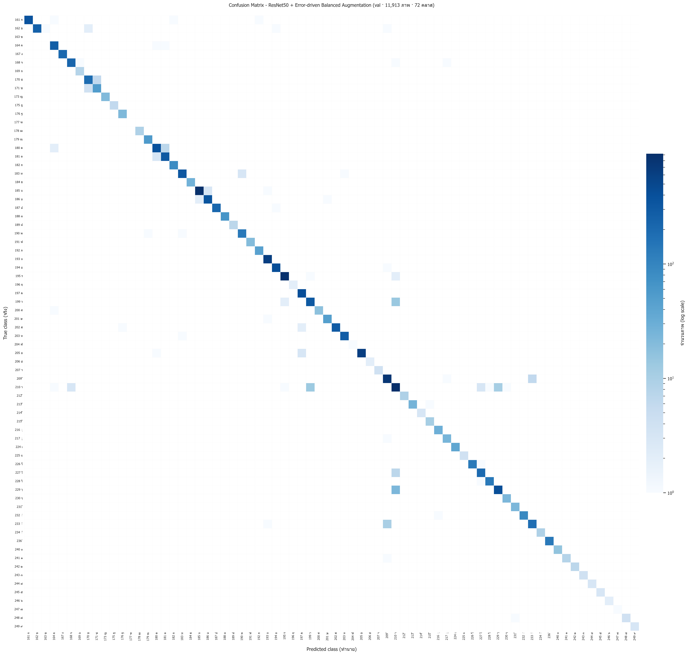
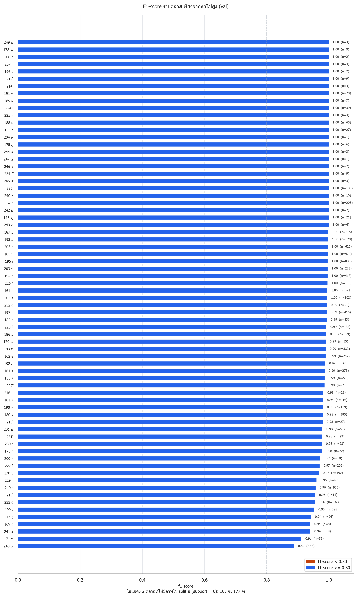
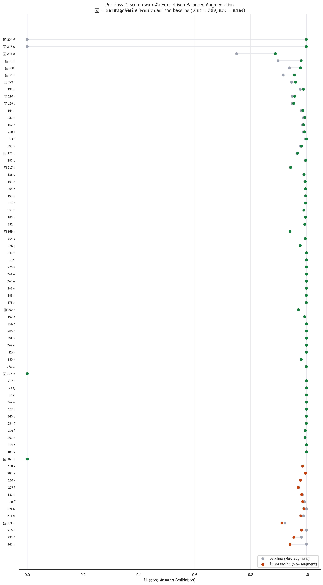

# ผลการทดลอง: รู้จำตัวอักษร/ตัวเลขภาษาไทย 72 คลาส

**ResNet50 (Transfer Learning) + Error-driven Balanced Data Augmentation** · PyTorch

สร้างรายงานนี้อัตโนมัติจากไฟล์ผลลัพธ์จริงด้วย `make_results.py` เมื่อ 2026-09-23

## 1. ผลลัพธ์สรุป

| ชุดข้อมูล | Accuracy | **Macro F1** | Weighted F1 | Balanced Acc | Top-5 Acc | จำนวนภาพ |
|---|---|---|---|---|---|---|
| Validation | 0.9859 | **0.9584** | 0.9859 | 0.9860 | 0.9985 | 11,913 |
| **Test 5% (ไม่เคยถูกเทรน)** | 0.9837 | **0.9455** | 0.9835 | 0.9707 | 0.9990 | 3,136 |

> **ทำไมดู Macro F1 เป็นหลัก**: คลาสใหญ่สุดของชุดนี้มีภาพมากกว่าคลาสเล็กสุด หลายพันเท่า Accuracy จึงถูกคลาสใหญ่ครอบงำ - คลาสเล็กพังทั้งคลาสก็ยังทำให้ accuracy ดูดีได้ Macro F1 ให้น้ำหนักทุกคลาสเท่ากันจึงเป็นตัวเลขที่บอกความ สามารถจริง และเป็นเกณฑ์ที่ใช้เลือก best checkpoint ในการเทรนด้วย

**การเทรน**

- เทรนไป 10 epochs, best ที่ epoch 8 (เกณฑ์ = `macro_f1`)
- train accuracy epoch สุดท้าย = 0.9998 · train macro F1 = 0.9998
- val accuracy ที่ดีที่สุด = 0.9859 · val macro F1 ที่ดีที่สุด = 0.9584

## 2. ชุดข้อมูล

- **จำนวนคลาส**: 72 คลาส (พยัญชนะ สระ วรรณยุกต์ และเลขไทย)
- **จำนวนภาพรวม**: 62,707 ภาพ
- **โครงสร้างโฟลเดอร์**: `ThaiCharacter Dataset/round2/<รหัสคลาส>/*.jpg` (รหัสคลาสเป็นตัวเลข map เป็นอักษรไทยด้วย `label.json`)
- **ขนาดภาพต้นฉบับ**: เล็กมาก ประมาณ 12×18 ถึง 30×45 px (ขยายเป็น 224×224 ก่อนเข้าโมเดล)
- **ความไม่สมดุล**: มากสุด 210 า = 5,025 ภาพ, น้อยสุด 163 ฃ = 1 ภาพ → **ต่างกัน 5,025 เท่า**

<details><summary>จำนวนภาพต่อคลาส ทั้ง 72 คลาส (กดเพื่อดู)</summary>

| อันดับ | คลาส | จำนวนภาพ |
|---|---|---|
| 1 | 210 า | 5,025 |
| 2 | 185 น | 4,863 |
| 3 | 195 ร | 4,663 |
| 4 | 209 ั | 4,120 |
| 5 | 193 ม | 3,306 |
| 6 | 205 อ | 3,272 |
| 7 | 229 ๅ | 2,310 |
| 8 | 194 ย | 2,197 |
| 9 | 197 ล | 2,187 |
| 10 | 180 ด | 2,025 |
| 11 | 161 ก | 1,951 |
| 12 | 186 บ | 1,889 |
| 13 | 183 ท | 1,745 |
| 14 | 199 ว | 1,724 |
| 15 | 181 ต | 1,662 |
| 16 | 202 ส | 1,595 |
| 17 | 203 ห | 1,490 |
| 18 | 164 ค | 1,448 |
| 19 | 162 ข | 1,355 |
| 20 | 168 จ | 1,202 |
| 21 | 187 ป | 1,133 |
| 22 | 227 ใ | 1,086 |
| 23 | 167 ง | 1,078 |
| 24 | 170 ช | 1,013 |
| 25 | 233 ◌้ | 1,008 |
| 26 | 190 พ | 729 |
| 27 | 236 ์ | 726 |
| 28 | 228 ไ | 725 |
| 29 | 226 โ | 699 |
| 30 | 232 ◌่ | 479 |
| 31 | 182 ถ | 435 |
| 32 | 188 ผ | 344 |
| 33 | 171 ซ | 295 |
| 34 | 179 ณ | 292 |
| 35 | 201 ษ | 264 |
| 36 | 192 ภ | 239 |
| 37 | 224 เ | 203 |
| 38 | 216 ◌ุ | 155 |
| 39 | 184 ธ | 143 |
| 40 | 213 ี | 143 |
| 41 | 217 ◌ู | 139 |
| 42 | 230 ๆ | 121 |
| 43 | 231 ็ | 119 |
| 44 | 176 ฐ | 118 |
| 45 | 173 ญ | 113 |
| 46 | 191 ฟ | 103 |
| 47 | 200 ศ | 94 |
| 48 | 240 ๐ | 83 |
| 49 | 215 ื | 60 |
| 50 | 234 ◌๊ | 49 |
| 51 | 178 ฒ | 48 |
| 52 | 212 ิ | 47 |
| 53 | 241 ๑ | 46 |
| 54 | 169 ฉ | 43 |
| 55 | 189 ฝ | 39 |
| 56 | 242 ๒ | 39 |
| 57 | 175 ฎ | 32 |
| 58 | 248 ๘ | 27 |
| 59 | 243 ๓ | 23 |
| 60 | 225 แ | 21 |
| 61 | 207 ฯ | 20 |
| 62 | 245 ๕ | 17 |
| 63 | 244 ๔ | 16 |
| 64 | 249 ๙ | 14 |
| 65 | 214 ึ | 14 |
| 66 | 196 ฤ | 13 |
| 67 | 246 ๖ | 12 |
| 68 | 206 ฮ | 10 |
| 69 | 247 ๗ | 4 |
| 70 | 204 ฬ | 3 |
| 71 | 163 ฃ | 1 |
| 72 | 177 ฑ | 1 |

</details>

**การแบ่งข้อมูล** (stratified ภายในทุกคลาส, ล็อกด้วย `SEED = 42`)

| split | จำนวนภาพ | สัดส่วน | ใช้ทำอะไร |
|---|---|---|---|
| train | 47,658 | 76.0% | เทรน + augment |
| val | 11,913 | 19.0% | วัดผลทุก epoch, เลือก best checkpoint |
| test | 3,136 | 5.0% | **กันไว้ตรวจ ไม่เคยถูกเทรนหรือ augment** |

ตัด test 5% ออกก่อนเป็นอย่างแรก แล้วแบ่งส่วนที่เหลือเป็น train/val = 80/20 (`run_step1_explore.py`) manifest ของ augmentation สร้างจากแถวที่ `split == "train"` เท่านั้น และมี `assert` กำกับไว้ในโค้ด

> ข้อจำกัดที่ต้องระบุ: 2 คลาสไม่มีภาพในชุด test เลย (163 ฃ, 177 ฑ) เพราะทั้งคลาสมีภาพน้อยเกินกว่าจะแบ่งสามทางได้

## 3. โครงสร้างโมเดล (CNN)

**ResNet50** (Deep Residual Network, 50 ชั้น) จาก `torchvision.models.resnet50`

```
Input 3 × 224 × 224
  conv1      7×7, 64 filters, stride 2      -> 64 × 112 × 112
  maxpool    3×3, stride 2                  -> 64 × 56 × 56
  layer1     bottleneck × 3  (64→256)       -> 256 × 56 × 56
  layer2     bottleneck × 4  (128→512)      -> 512 × 28 × 28
  layer3     bottleneck × 6  (256→1024)     -> 1024 × 14 × 14
  layer4     bottleneck × 3  (512→2048)     -> 2048 × 7 × 7
  avgpool    global average pooling         -> 2048
  fc         Linear(2048 → 72)              -> 72 logits  ← เปลี่ยนชั้นนี้เอง
```

- **พารามิเตอร์รวม ~23.66 ล้านตัว เทรนทั้งหมด** (unfreeze ทุกชั้น)
- แต่ละ bottleneck block = conv 1×1 → conv 3×3 → conv 1×1 + skip connection ซึ่งเป็นหัวใจของ ResNet: skip connection ทำให้ gradient ไหลข้ามชั้นได้ จึงเทรน โมเดลลึก 50 ชั้นได้โดยไม่เจอปัญหา vanishing gradient
- ชั้น `fc` เดิมของ ImageNet มี 1000 output (1000 คลาสภาพถ่าย) ถูกแทนด้วย `nn.Linear(2048, 72)` ที่สุ่มค่าเริ่มต้นใหม่

## 4. Transfer Learning

| รายการ | ค่าที่ใช้ |
|---|---|
| น้ำหนักเริ่มต้น | `ResNet50_Weights.IMAGENET1K_V2` (pretrained บน ImageNet) |
| กลยุทธ์ | **fine-tune ทั้งโมเดล** (unfreeze ทุกชั้น) |
| Loss | `CrossEntropyLoss(label_smoothing=0.1)` |
| Optimizer | `AdamW` (lr = 0.0001, weight_decay = 0.01) |
| Scheduler | `CosineAnnealingLR` (lr ลดแบบโคไซน์จนเกือบ 0) |
| Batch size | 48 (train) / 96 (eval) |
| Epochs | 10 |
| Mixed precision | เปิด (`torch.autocast` fp16 + `GradScaler`) |
| Normalize | ImageNet mean/std `(0.485,0.456,0.406)` / `(0.229,0.224,0.225)` |
| Seed | 42 (ล็อก `random`, `numpy`, `torch`, `cuda`) |

**เหตุผลที่ fine-tune ทั้งโมเดลไม่ใช่ freeze แล้วเทรนแค่ fc**: ImageNet เป็นภาพถ่าย ธรรมชาติ (สัตว์ สิ่งของ ทิวทัศน์) ส่วนงานนี้เป็นลายเส้นขาว-ดำของตัวอักษร ฟีเจอร์ ชั้นกลาง-ปลายของ ImageNet (texture ขนสัตว์ ลายผ้า สีวัตถุ) แทบไม่ตรงกับงานนี้ ถ้า freeze ไว้โมเดลจะติดเพดานเร็ว การ unfreeze ทั้งหมดด้วย lr ต่ำ (1e-4) ให้ทุกชั้น ปรับเข้าหาลายเส้นได้ ขณะที่ยังได้ประโยชน์จาก edge/stroke detector ชั้นต้นที่ pretrained มาแล้ว (เทรนจากศูนย์บนภาพเล็ก ๆ 47k ภาพจะ overfit ง่ายกว่ามาก)

## 5. Baseline เพื่อหา "คลาสที่ทายผิดบ่อย"

เทรน ResNet50 แบบเดียวกัน 3 epochs บน train ที่**ยังไม่ augment** เพื่อดู error pattern ได้ผลบน validation:

- Accuracy = 0.9846 · Macro F1 = 0.9273 · Balanced accuracy = 0.9541

จากนั้นเลือกคลาสอ่อนแอด้วย per-class **f1-score** ตามเกณฑ์ `both` = union ของสองกฎ:

- `mean - 1SD`: ค่าเฉลี่ย 0.954 − SD 0.167 = **0.786** → ได้ 3 คลาส
- `bottom 20%`: ค่าตัดที่ **0.973** → ได้ 14 คลาส
- คลาสที่ไม่มีภาพใน val (ข้อมูลน้อยเกินไป) ถูกนับเป็นคลาสอ่อนแอโดยปริยาย อีก 2 คลาส

**รวม 16 คลาสที่ถูกจัดเป็น "ทายผิดบ่อย"** และจะได้ augmentation แบบเข้มข้นกว่าคลาสอื่น:

> 163 ฃ · 169 ฉ · 170 ช · 171 ซ · 177 ฑ · 199 ว · 200 ศ · 204 ฬ · 210 า · 213 ี · 215 ื · 217 ◌ู · 229 ๅ · 231 ็ · 247 ๗ · 248 ๘

<details><summary>10 คลาสที่ F1 ต่ำสุดของ baseline (กดเพื่อดู)</summary>

| คลาส | Precision | Recall | F1 | จำนวนภาพ val |
|---|---|---|---|---|
| 204 ฬ | 0.000 | 0.000 | 0.000 | 1 |
| 247 ๗ | 0.000 | 0.000 | 0.000 | 1 |
| 248 ๘ | 1.000 | 0.600 | 0.750 | 5 |
| 213 ี | 1.000 | 0.815 | 0.898 | 27 |
| 215 ื | 0.846 | 1.000 | 0.917 | 11 |
| 171 ซ | 0.885 | 0.964 | 0.923 | 56 |
| 231 ็ | 0.885 | 1.000 | 0.939 | 23 |
| 169 ฉ | 0.889 | 1.000 | 0.941 | 8 |
| 217 ◌ู | 0.960 | 0.923 | 0.941 | 26 |
| 229 ๅ | 0.915 | 0.982 | 0.947 | 439 |

</details>

## 6. Error-driven + Balanced Data Augmentation

| รายการ | ค่า |
|---|---|
| target ต่อคลาส | 3,819 ภาพ (= จำนวนของคลาสที่เยอะสุด) |
| train ก่อน augment | 47,658 ภาพ |
| train หลัง augment | **274,968 ภาพ** (5.77×) |
| ภาพที่สังเคราะห์เพิ่ม | 227,310 ภาพ |
| ความไม่สมดุล | 3819.0 เท่า → **1.0 เท่า** |
| คลาสที่ได้ augment เข้มข้น | 16 คลาส |
| แยกตามชนิด | `normal` 174,565, `intense` 52,745, `original` 47,658 |

**วิธีทำ**: ทุกคลาสที่มีภาพน้อยกว่า target จะถูกเติมด้วยภาพ augment จนครบ target โดยวนใช้ภาพต้นฉบับแบบ round-robin (ทุกภาพถูกใช้เป็นต้นแบบใกล้เคียงกัน ไม่ใช่สุ่มจนภาพบางใบถูกใช้ 10 ครั้งอีกใบ 0 ครั้ง) คลาสที่อยู่ในลิสต์ "ทายผิดบ่อย" จากข้อ 5 ใช้ transform ชุดเข้มข้นกว่า

ภาพ augment ไม่ได้เขียนลงดิสก์ แต่เก็บเป็น *manifest* ที่บอกว่า (ภาพต้นฉบับใด, ความเข้มระดับใด, seed อะไร) แล้วแปลงตอนโหลดภายใน `torch.random.fork_rng()` ที่ล็อก seed ไว้ ผลคือได้ชุดภาพ augment ที่**คงที่ทุก epoch และ reproduce ได้ 100%** เทียบเท่ามีไฟล์ภาพจริง 274,968 ไฟล์ แต่ไม่กินดิสก์ ~20GB

**Transform ที่ใช้** (`torch_pipeline/augment.py`)

| เทคนิค | ปกติ (normal) | เข้มข้น (intense) |
|---|---|---|
| RandomRotation | ±10° | ±15° |
| RandomAffine translate | 5% | 8% |
| RandomAffine scale | 0.88–1.05 | 0.80–1.05 |
| RandomAffine shear | 4° | 8° |
| ElasticTransform | ไม่ใช้ | alpha 35, sigma 5 (p=0.50) |
| Morphological dilate/erode | p=0.25 | p=0.45 |
| GaussianBlur | p=0.20 | p=0.30 |
| ColorJitter (brightness/contrast) | 0.12 | 0.20 |
| Gaussian noise | std 0.015 (p=0.30) | std 0.025 (p=0.50) |
| RandomErasing | ไม่ใช้ | p=0.15, พื้นที่ 1–4% |
| **Horizontal / Vertical Flip** | **ห้ามใช้** | **ห้ามใช้** |

**ทำไมห้าม flip**: ตัวอักษรไทยมีทิศทาง พลิกซ้าย-ขวาแล้วได้รูปที่เป็นอักขระอื่น หรือไม่มีในภาษา (เช่น "ก" พลิกแล้วคล้าย "ฎ/ฏ") การ flip คือการป้อน label ผิด ให้โมเดลโดยตรง

**Morphological dilate/erode** ทำด้วย `ImageFilter.MinFilter/MaxFilter` บนภาพหมึกเข้ม บนพื้นขาว: MinFilter ทำให้เส้นหนาขึ้น MaxFilter ทำให้เส้นบางลง เลียนแบบการเขียนด้วย ปากกาหัวใหญ่/เล็กหรือกดหนัก/เบา ซึ่งเป็นความแปรผันที่พบมากที่สุดในลายมือจริง

ทุก transform เชิงเรขาคณิตเติมพื้นที่ว่างด้วย**สีขาว** (ไม่ใช่ดำ) ให้ตรงกับพื้นหลัง ของภาพจริง ไม่งั้นจะเกิดขอบดำปลอมที่โมเดลอาจเรียนรู้เป็น feature และเพดาน scale หยุดที่ 1.05 เพราะตัวอักษรกินพื้นที่เกือบเต็มเฟรมอยู่แล้ว ซูมเข้ามากกว่านี้เส้นจะถูก ตัดหายที่ขอบจนกลายเป็นตัวอักษรอื่น

## 7. ผลการเทรนและกราฟ

| Epoch | Train Loss | Train Acc | Train F1 | Val Loss | Val Acc | **Val Macro F1** |
|---|---|---|---|---|---|---|
| 1.0000 | 0.8435 | 0.9749 | 0.9749 | 0.8111 | 0.9781 | 0.9479 |
| 2.0000 | 0.7650 | 0.9941 | 0.9941 | 0.8109 | 0.9782 | 0.9449 |
| 3.0000 | 0.7589 | 0.9955 | 0.9955 | 0.7998 | 0.9823 | 0.9453 |
| 4.0000 | 0.7545 | 0.9964 | 0.9964 | 0.8050 | 0.9794 | 0.9560 |
| 5.0000 | 0.7510 | 0.9974 | 0.9974 | 0.7907 | 0.9849 | 0.9552 |
| 6.0000 | 0.7484 | 0.9981 | 0.9981 | 0.7940 | 0.9822 | 0.9552 |
| 7.0000 | 0.7463 | 0.9988 | 0.9988 | 0.7909 | 0.9858 | 0.9580 |
| 8.0000 | 0.7448 | 0.9994 | 0.9994 | 0.7919 | 0.9859 | 0.9584 |
| 9.0000 | 0.7440 | 0.9996 | 0.9996 | 0.7942 | 0.9856 | 0.9561 |
| 10.0000 | 0.7434 | 0.9998 | 0.9998 | 0.7941 | 0.9862 | 0.9570 |



กราฟสามแผง: Loss, **Accuracy Rate** ของ train/val และ **Macro F1** ของ train/val (วงกลมเขียว = epoch ที่ถูกเลือกเป็น best checkpoint ตามเกณฑ์ macro F1)

### Confusion Matrix



(เวอร์ชัน normalized ต่อแถวอยู่ที่ `05_confusion_matrix_val_normalized.png` และของชุด test อยู่ที่ `06_test_confusion_matrix.png`)

### F1 รายคลาส



คลาสที่วัดได้ 70 คลาส · F1 < 0.8 มี **0 คลาส**

**10 คลาสที่ F1 ต่ำสุด** (คลาสที่ยังเป็นจุดอ่อนของโมเดลสุดท้าย)

| คลาส | Precision | Recall | F1 | จำนวนภาพ val |
|---|---|---|---|---|
| 248 ๘ | 1.000 | 0.800 | 0.889 | 5 |
| 171 ซ | 0.897 | 0.929 | 0.912 | 56 |
| 169 ฉ | 0.889 | 1.000 | 0.941 | 8 |
| 241 ๑ | 1.000 | 0.889 | 0.941 | 9 |
| 217 ◌ู | 0.926 | 0.962 | 0.943 | 26 |
| 199 ว | 0.957 | 0.951 | 0.954 | 328 |
| 233 ◌้ | 0.968 | 0.943 | 0.955 | 192 |
| 215 ื | 0.917 | 1.000 | 0.957 | 11 |
| 210 า | 0.951 | 0.964 | 0.958 | 955 |
| 229 ๅ | 0.974 | 0.948 | 0.961 | 439 |

<details><summary>Classification report ครบทั้ง 72 คลาส (กดเพื่อดู)</summary>

| คลาส | Precision | Recall | F1 | Support |
|---|---|---|---|---|
| 163 ฃ | 0.000 | 0.000 | 0.000 | 0 |
| 177 ฑ | 0.000 | 0.000 | 0.000 | 0 |
| 248 ๘ | 1.000 | 0.800 | 0.889 | 5 |
| 171 ซ | 0.897 | 0.929 | 0.912 | 56 |
| 241 ๑ | 1.000 | 0.889 | 0.941 | 9 |
| 169 ฉ | 0.889 | 1.000 | 0.941 | 8 |
| 217 ◌ู | 0.926 | 0.962 | 0.943 | 26 |
| 199 ว | 0.957 | 0.951 | 0.954 | 328 |
| 233 ◌้ | 0.968 | 0.943 | 0.955 | 192 |
| 215 ื | 0.917 | 1.000 | 0.957 | 11 |
| 210 า | 0.951 | 0.964 | 0.958 | 955 |
| 229 ๅ | 0.974 | 0.948 | 0.961 | 439 |
| 170 ช | 0.969 | 0.969 | 0.969 | 192 |
| 227 ใ | 0.975 | 0.966 | 0.971 | 206 |
| 200 ศ | 1.000 | 0.944 | 0.971 | 18 |
| 176 ฐ | 0.957 | 1.000 | 0.978 | 22 |
| 230 ๆ | 0.958 | 1.000 | 0.979 | 23 |
| 231 ็ | 0.958 | 1.000 | 0.979 | 23 |
| 201 ษ | 0.980 | 0.980 | 0.980 | 50 |
| 213 ี | 1.000 | 0.963 | 0.981 | 27 |
| 180 ด | 0.987 | 0.977 | 0.982 | 385 |
| 190 พ | 0.979 | 0.986 | 0.982 | 139 |
| 181 ต | 0.975 | 0.991 | 0.983 | 316 |
| 216 ◌ุ | 0.967 | 1.000 | 0.983 | 29 |
| 209 ั | 0.982 | 0.991 | 0.987 | 783 |
| 168 จ | 0.987 | 0.987 | 0.987 | 228 |
| 164 ค | 0.982 | 0.993 | 0.987 | 275 |
| 192 ภ | 0.978 | 1.000 | 0.989 | 45 |
| 162 ข | 1.000 | 0.981 | 0.990 | 257 |
| 183 ท | 0.994 | 0.988 | 0.991 | 332 |
| 179 ณ | 0.982 | 1.000 | 0.991 | 55 |
| 186 บ | 0.992 | 0.992 | 0.992 | 359 |
| 228 ไ | 0.993 | 0.993 | 0.993 | 138 |
| 182 ถ | 0.988 | 1.000 | 0.994 | 83 |
| 197 ล | 0.988 | 1.000 | 0.994 | 416 |
| 232 ◌่ | 1.000 | 0.989 | 0.994 | 91 |
| 202 ส | 1.000 | 0.990 | 0.995 | 303 |
| 161 ก | 1.000 | 0.992 | 0.996 | 371 |
| 226 โ | 1.000 | 0.992 | 0.996 | 133 |
| 194 ย | 0.995 | 0.998 | 0.996 | 417 |
| 203 ห | 0.996 | 0.996 | 0.996 | 283 |
| 195 ร | 0.997 | 0.997 | 0.997 | 886 |
| 185 น | 0.998 | 0.996 | 0.997 | 924 |
| 205 อ | 1.000 | 0.994 | 0.997 | 622 |
| 193 ม | 0.995 | 1.000 | 0.998 | 628 |
| 187 ป | 1.000 | 0.995 | 0.998 | 215 |
| 243 ๓ | 1.000 | 1.000 | 1.000 | 4 |
| 173 ญ | 1.000 | 1.000 | 1.000 | 21 |
| 242 ๒ | 1.000 | 1.000 | 1.000 | 7 |
| 167 ง | 1.000 | 1.000 | 1.000 | 205 |
| 240 ๐ | 1.000 | 1.000 | 1.000 | 16 |
| 236 ์ | 1.000 | 1.000 | 1.000 | 138 |
| 245 ๕ | 1.000 | 1.000 | 1.000 | 3 |
| 234 ◌๊ | 1.000 | 1.000 | 1.000 | 9 |
| 246 ๖ | 1.000 | 1.000 | 1.000 | 2 |
| 247 ๗ | 1.000 | 1.000 | 1.000 | 1 |
| 244 ๔ | 1.000 | 1.000 | 1.000 | 3 |
| 175 ฎ | 1.000 | 1.000 | 1.000 | 6 |
| 204 ฬ | 1.000 | 1.000 | 1.000 | 1 |
| 184 ธ | 1.000 | 1.000 | 1.000 | 27 |
| 188 ผ | 1.000 | 1.000 | 1.000 | 65 |
| 225 แ | 1.000 | 1.000 | 1.000 | 4 |
| 224 เ | 1.000 | 1.000 | 1.000 | 39 |
| 189 ฝ | 1.000 | 1.000 | 1.000 | 7 |
| 191 ฟ | 1.000 | 1.000 | 1.000 | 20 |
| 214 ึ | 1.000 | 1.000 | 1.000 | 3 |
| 212 ิ | 1.000 | 1.000 | 1.000 | 9 |
| 196 ฤ | 1.000 | 1.000 | 1.000 | 2 |
| 207 ฯ | 1.000 | 1.000 | 1.000 | 4 |
| 206 ฮ | 1.000 | 1.000 | 1.000 | 2 |
| 178 ฒ | 1.000 | 1.000 | 1.000 | 9 |
| 249 ๙ | 1.000 | 1.000 | 1.000 | 3 |

</details>

### ผลของ Error-driven Balanced Augmentation (เทียบ baseline)

| กลุ่มคลาส | F1 ก่อน (baseline) | F1 หลัง | ส่วนต่าง |
|---|---|---|---|
| ทุกคลาส | 0.9538 | 0.9858 | **+0.0319** |
| เฉพาะคลาสที่ทายผิดบ่อย (14 คลาส) | 0.7922 | 0.9582 | **+0.1660** |
| คลาสอื่น ๆ | - | - | -0.0016 |

F1 ดีขึ้น 30 คลาส / แย่ลง 12 คลาส



**10 คลาสที่ F1 ดีขึ้นมากที่สุด** (★ = อยู่ในลิสต์ทายผิดบ่อย)

| คลาส | F1 baseline | F1 สุดท้าย | ส่วนต่าง | เคยเป็นคลาสอ่อนแอ |
|---|---|---|---|---|
| 204 ฬ | 0.000 | 1.000 | +1.000 | ★ |
| 247 ๗ | 0.000 | 1.000 | +1.000 | ★ |
| 248 ๘ | 0.750 | 0.889 | +0.139 | ★ |
| 213 ี | 0.898 | 0.981 | +0.083 | ★ |
| 231 ็ | 0.939 | 0.979 | +0.040 | ★ |
| 215 ื | 0.917 | 0.957 | +0.040 | ★ |
| 229 ๅ | 0.947 | 0.961 | +0.013 | ★ |
| 192 ภ | 0.978 | 0.989 | +0.011 |  |
| 210 า | 0.949 | 0.958 | +0.009 | ★ |
| 199 ว | 0.949 | 0.954 | +0.005 | ★ |

### คู่คลาสที่โมเดลยังสับสนมากที่สุด (validation)

| คลาสจริง | ทำนายเป็น | จำนวนครั้ง | % ของคลาสจริง |
|---|---|---|---|
| 229 ๅ | 210 า | 23 | 5.24% |
| 199 ว | 210 า | 14 | 4.27% |
| 210 า | 199 ว | 13 | 1.36% |
| 210 า | 229 ๅ | 11 | 1.15% |
| 233 ้ | 209 ั | 10 | 5.21% |
| 227 ใ | 210 า | 7 | 3.4% |
| 180 ด | 181 ต | 7 | 1.82% |
| 170 ช | 171 ซ | 6 | 3.12% |
| 209 ั | 233 ้ | 6 | 0.77% |
| 171 ซ | 170 ช | 4 | 7.14% |

## 8. ผลบนชุด test 5%

ชุดนี้ถูกกันออกตั้งแต่ขั้นแรกและ**ไม่เคยถูกใช้เทรนหรือ augment** (3,136 ภาพ)

- **Accuracy = 0.9837**
- **Macro F1 = 0.9455**
- Weighted F1 = 0.9835 · Balanced accuracy = 0.9707 · Top-5 accuracy = 0.9990

ไฟล์ผลทำนายรายภาพ: `outputs_torch/reports/06_test_predictions.csv` (filename, true_class_id, pred_class_id, pred_char, confidence, correct, top-3)

**10 คลาสที่ F1 ต่ำสุดในชุด test**

| คลาส | Precision | Recall | F1 | Support |
|---|---|---|---|---|
| 206 ฮ | 0.000 | 0.000 | 0.000 | 1 |
| 178 ฒ | 1.000 | 0.500 | 0.667 | 2 |
| 217 ◌ู | 0.778 | 1.000 | 0.875 | 7 |
| 229 ๅ | 0.963 | 0.888 | 0.924 | 116 |
| 210 า | 0.917 | 0.968 | 0.942 | 251 |
| 199 ว | 0.976 | 0.930 | 0.952 | 86 |
| 171 ซ | 1.000 | 0.933 | 0.966 | 15 |
| 181 ต | 0.988 | 0.952 | 0.969 | 83 |
| 180 ด | 0.961 | 0.980 | 0.971 | 101 |
| 227 ใ | 0.981 | 0.963 | 0.972 | 54 |

**คู่ที่ทายผิดบ่อยที่สุดในชุด test**

| คลาสจริง | ทำนายเป็น | จำนวนครั้ง | % ของคลาสจริง |
|---|---|---|---|
| 229 ๅ | 210 า | 13 | 11.21% |
| 199 ว | 210 า | 6 | 6.98% |
| 210 า | 229 ๅ | 4 | 1.59% |
| 181 ต | 180 ด | 3 | 3.61% |
| 227 ใ | 210 า | 2 | 3.7% |
| 210 า | 199 ว | 2 | 0.8% |
| 170 ช | 162 ข | 1 | 1.96% |
| 194 ย | 209 ั | 1 | 0.91% |
| 164 ค | 180 ด | 1 | 1.39% |
| 181 ต | 168 จ | 1 | 1.2% |

## 9. วิธีรันซ้ำ

```bash
uv sync
uv run python run_step1_explore.py          # สำรวจ + แบ่ง train/val/test
uv run python run_step2_baseline.py --epochs 3 --num-workers 4
uv run python run_step3_augment_plan.py     # balanced manifest + กราฟก่อน-หลัง
uv run python run_step4_train.py --epochs 10 --num-workers 4
uv run python run_step5_evaluate.py         # confusion matrix + รายงานต่อคลาส
uv run python run_step6_test_inference.py   # ทำนายชุด test 5%
uv run python make_results.py               # สร้างไฟล์นี้ใหม่จากผลจริง
```

รายละเอียดการตัดสินใจทางเทคนิคและข้อควรระวังอยู่ใน `PYTORCH_PIPELINE.md`

**หมายเหตุ**: checkpoint `.pth` (95–284MB) ไม่ได้ commit ขึ้น repo เพราะเกินลิมิต 100MB ต่อไฟล์ของ GitHub - ถ้าต้องการเก็บโมเดลให้ใช้ Git LFS (ดูคำแนะนำใน `.gitignore`)
